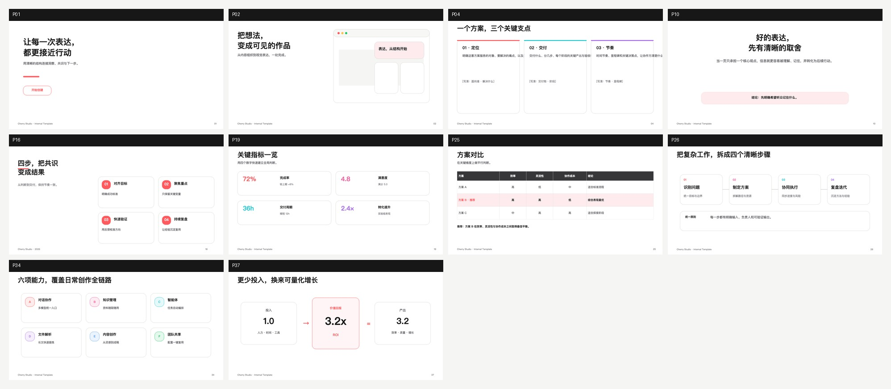

# Feishu PPT Skill — Lark Slides Template Library for AI Agents

AI-agent skill for building **Lark (Feishu) slides via the `lark-cli`**: a 51-page template library, brand design tokens, XML generation workflow, and automated layout review.

Built as a reusable SKILL.md so agents can produce polished, on-brand presentations quickly — pick a template, swap content, lint, publish.

## Template preview



*Sample pages rendered as crisp vectors: cover, TOC, three-column, statement, step cards (P16), metric grid, comparison table, process flow, feature matrix, ROI. Full-resolution vector previews of every page live in [`docs/preview/`](docs/preview/).*

## What's inside

```
.
├── SKILL.md                 # Design spec + template workflow + CLI commands + troubleshooting
├── tokens.yaml              # Single source of truth for design tokens (42-color whitelist)
├── templates/
│   ├── INDEX.md             # 51-page scene index (per page: use case / structure / replace list)
│   └── slide01.xml ~ slide51.xml  # 960×540 Lark Slides XML templates
├── assets/
│   ├── cherry-logo.png      # Example logo asset (1024×1024 transparent PNG)
│   └── product-placeholder.png  # Product screenshot placeholder
├── scripts/
│   ├── review_layout.py     # Automated layout check (overlap / overflow / out-of-bounds)
│   └── review_design.py     # Design guardrails G1-G8 (color whitelist / typography / CTA / density)
└── docs/
    ├── template-preview-hd.jpg # 10-page HD preview grid (2× scale)
    └── preview/                # 51 per-page vector SVG previews + sample HD PNG
```

## Template coverage

| Category | Pages | Range |
|----------|-------|-------|
| Cover / transition / closing | 7 | P1-P6, P51 |
| TOC / navigation | 3 | P7-P9 |
| Text / argumentation | 8 | P10-P17 |
| Data / charts | 8 | P18-P25 |
| Flow / architecture | 7 | P26-P32 |
| Product / solution | 6 | P33-P38 |
| Planning / org | 6 | P39-P44 |
| Ecosystem / community | 6 | P45-P50 |

## Quick start (agent view)

1. Read `templates/INDEX.md`, pick a template by content type (scene matching)
2. Copy `slideXX.xml` + `assets/*.png` into a work dir
3. Replace sample content per the INDEX "replace" checklist — **clean ALL template placeholder text** (titles, footnotes, conclusion bars); keep brand tokens
4. Run the three-stage gate:
   ```bash
   # Stage 1: official schema lint (per slide, error_count must be 0)
   python3 <lark-slides>/scripts/xml_lint.py --input slideXX.xml
   # Stage 2: layout check (overlap / overflow / out-of-bounds)
   python3 scripts/review_layout.py --dir .
   # Stage 3: design guardrails (color whitelist / typography / CTA / density)
   python3 scripts/review_design.py --dir .
   ```
5. Screenshot-check with `lark-cli slides +screenshot` before publishing
6. Publish via `lark-cli slides +create / +add-slide`

## Design tokens

- White canvas `#FFFFFF` + bold black headings `#171717` + white cards with thin border `#D6D6D2`
- Coral red `#FF5A5F` as the single brand accent (logo #FF5757)
- **No dark fills**: black is for text/icon strokes only (no dark cards, headers, or CTA bars)
- **No bottom pill bars**: no full-width coral pills at page bottom (y>430)
- Exact palette & font sizes: `tokens.yaml` is the **single machine source** (42-color whitelist)
- 70/30 strategy: 70% follow a matched template layout, 30% adapt content area freely, 100% alignment accuracy (no overlap / overflow / off-canvas)

## Dependencies

- [larksuite/cli](https://github.com/larksuite/cli) (Lark Slides XML operations)
- Official `xml_lint.py` (inside the lark-slides skill) for XML validation

## License

- **Code, templates, and scripts**: MIT © 2026
- **Brand assets** (e.g. `assets/cherry-logo.png`): brand/logo assets are **not** covered by the MIT license — they are the property of their respective owners and included only as examples. Replace them with your own assets for production use.
